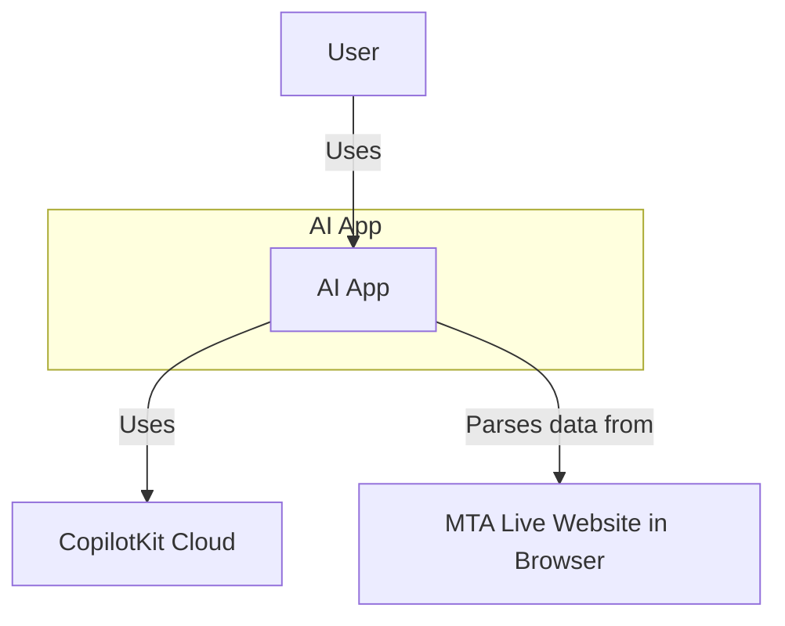
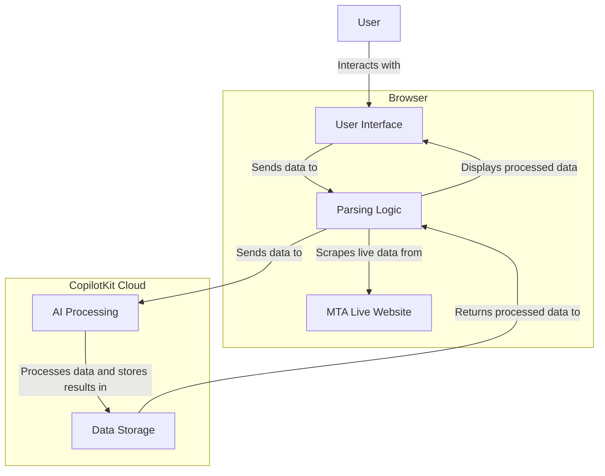
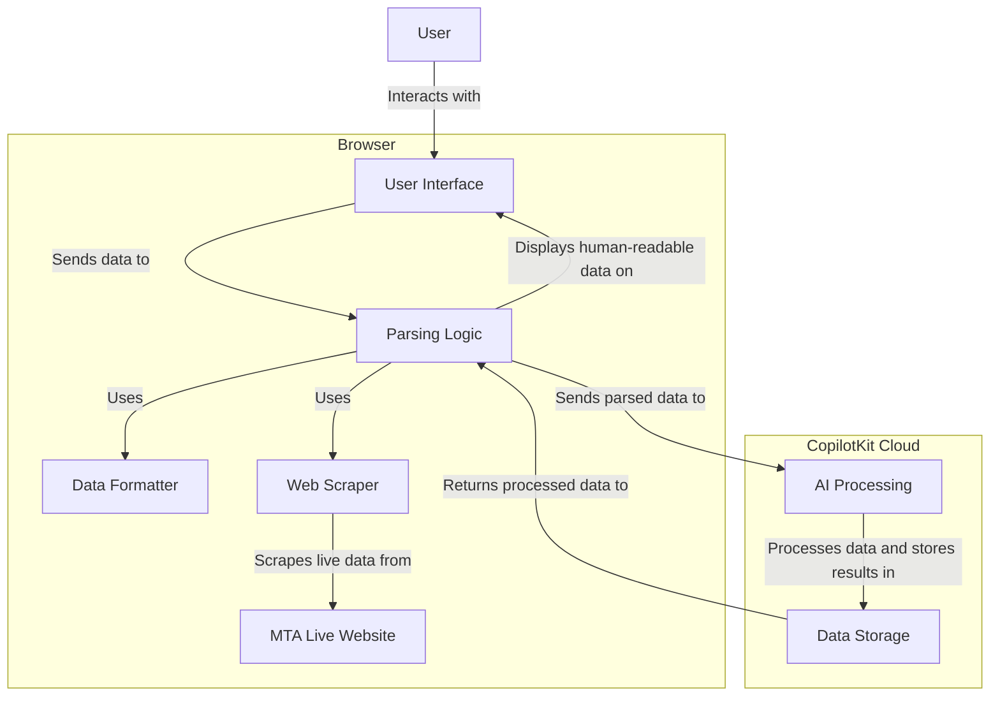

# Project Description

## Overview
This project aims to enhance the user experience of accessing Metropolitan Transportation Authority (MTA) information by providing a more readable and intuitive format for understanding delays and other relevant data. The MTA website, while comprehensive, often presents data in a format that can be challenging to navigate and understand quickly, especially during times of service disruptions or delays.

## Problem Statement
The MTA website's layout and presentation of data can be overwhelming for users, making it difficult to quickly ascertain critical information such as delays, service changes, and disruptions. The lack of readability and intuitive design can lead to frustration and delays in decision-making for commuters who rely on the MTA for their daily travel.

## Solution
Our solution is an AI-powered application that parses data directly from the MTA live website within the user's browser environment. By leveraging CopilotKit's cloud offerings, the application scrapes and processes the raw data, presenting it in a human-readable format. This approach enhances readability and intuitiveness, allowing users to quickly understand delays and service changes without having to decipher complex web layouts.

## Key Features
- **Real-time Data Parsing**: The application fetches live data from the MTA website, ensuring that users have access to the latest information.
- **Human-readable Presentation**: The parsed data is presented in a clear and intuitive format, making it easy for users to understand delays and service disruptions at a glance.
- **Integration with CopilotKit Cloud**: Leveraging CopilotKit's cloud offerings enhances the application's processing capabilities, enabling efficient data scraping and parsing.

## How to Use
To use the application, simply open it in your browser. The user interface provides an intuitive way to view MTA information in real-time, allowing you to stay informed about delays and service changes effortlessly.

## Why This Project?
This project addresses the need for a more user-friendly interface for accessing MTA information. By improving readability and intuitiveness, we aim to enhance the overall commuting experience for MTA users, reducing frustration and increasing efficiency in decision-making.

## Context diagram

### Container Diagram

### Component Diagram

