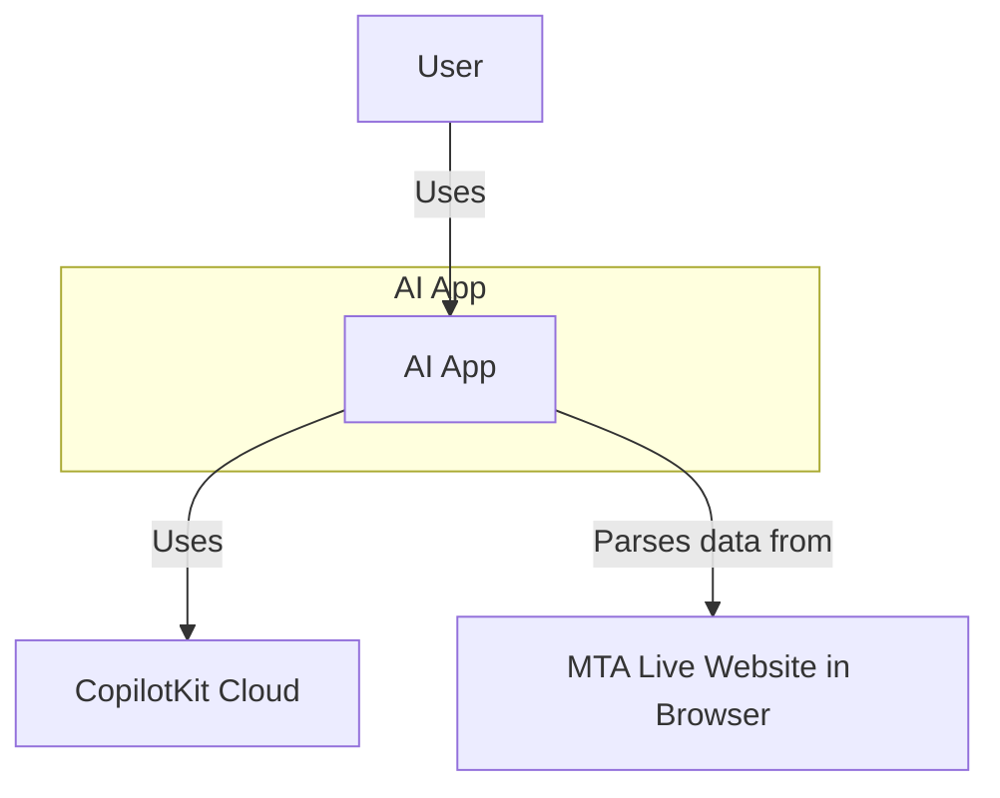
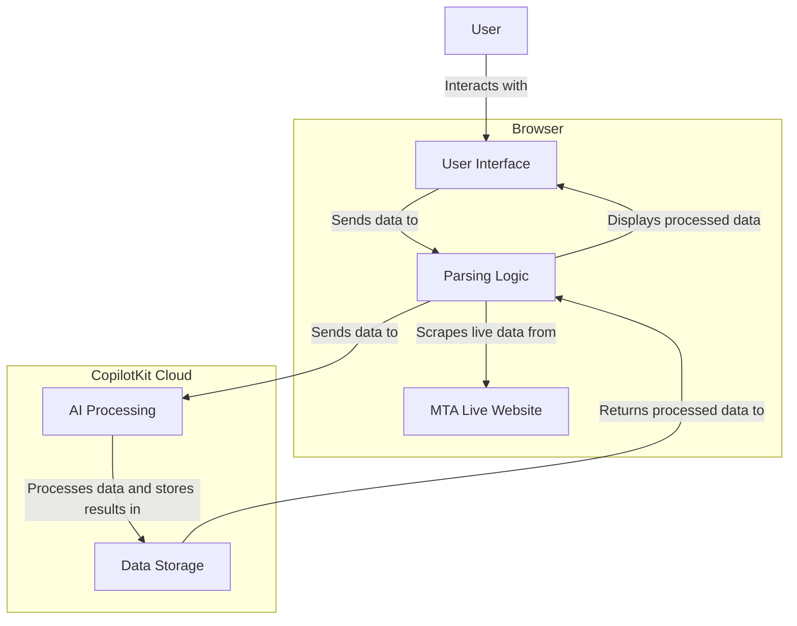
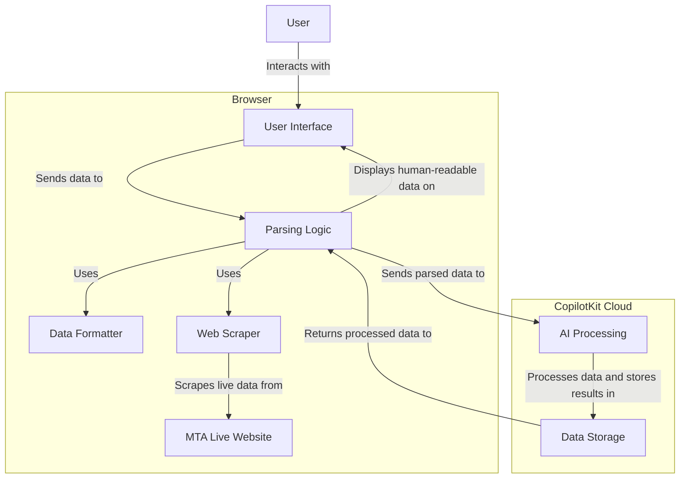

## Context diagram

```mermaid
graph TD
    subgraph AI App
        A[AI App]
    end
    U[User] -->|Uses| A
    A -->|Uses| B[CopilotKit Cloud]
    A -->|Parses data from| C[MTA Live Website in Browser]

```

### Container Diagram

```mermaid
graph TD
    subgraph Browser
        B1[User Interface]
        B2[Parsing Logic]
        B3[MTA Live Website]
    end
    subgraph CopilotKit Cloud
        C1[AI Processing]
        C2[Data Storage]
    end

    U[User] -->|Interacts with| B1
    B1 -->|Sends data to| B2
    B2 -->|Scrapes live data from| B3
    B2 -->|Sends data to| C1
    C1 -->|Processes data and stores results in| C2
    C2 -->|Returns processed data to| B2
    B2 -->|Displays processed data| B1
```

### Component Diagram

```mermaid
graph TD
    subgraph Browser
        B1[User Interface]
        B2[Parsing Logic]
        B3[Data Formatter]
        B4[Web Scraper]
        B5[MTA Live Website]
    end
    subgraph CopilotKit Cloud
        C1[AI Processing]
        C2[Data Storage]
    end

    U[User] -->|Interacts with| B1
    B1 -->|Sends data to| B2
    B2 -->|Uses| B3
    B2 -->|Uses| B4
    B4 -->|Scrapes live data from| B5
    B2 -->|Sends parsed data to| C1
    C1 -->|Processes data and stores results in| C2
    C2 -->|Returns processed data to| B2
    B2 -->|Displays human-readable data on| B1
```

